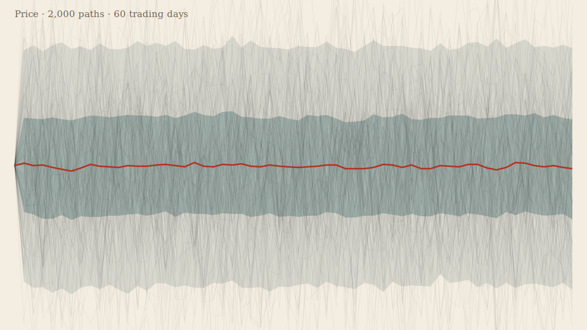

# Skein

**▶ Live demo — [apps.charliekrug.com/scenario-loom](https://apps.charliekrug.com/scenario-loom/)**

[](https://github.com/ctkrug/scenario-loom/actions/workflows/ci.yml)
[](LICENSE)

Watch a thousand futures fan out live. Skein is a Monte Carlo sandbox in the browser:
set a mean, a variance, and a correlation with three sliders and watch thousands of
simulated paths sweep the screen, tracing a fan chart that widens and narrows as you drag.



There is no dataset to load and no domain to pick. The same three numbers describe a
project timeline slipping, a batting average regressing, or a stock return spreading out.
Uncertainty is uncertainty, and Skein lets you see its shape instead of reading it off a
table of percentiles.

## Who it's for

Anyone who has asked "how uncertain is this, really?" and wanted to poke at the
assumptions instead of trusting one number: an engineer sanity-checking a project
estimate, someone arguing about regression to the mean, a person who wants to see what
"high variance" actually looks like. It assumes no statistics past "higher variance means
less certain" and "correlation means today depends on yesterday."

## What it does

- **Three core sliders:** mean (drift), variance (spread), and correlation (how strongly
  each step follows the last), plus a path-count slider from 50 to 5,000. Drag one and the
  cone of outcomes resimulates and redraws in under a second, 2,000 paths at a time.
- **A live fan chart:** 5/25/50/75/95 percentile bands drawn under the raw sample paths on
  a device-pixel-ratio-aware canvas. The vertical frame holds steady as you drag variance,
  so the cone visibly opens and closes instead of the whole view rescaling away.
- **Domain presets:** volatile stock, slipping timeline, streaky shooter, coin-flip
  baseline. Each reframes the same three sliders with new labels and starting values; the
  simulation never branches on which one is active.
- **Shareable and exportable:** the full scenario lives in the URL hash, so a link restores
  it exactly. One click exports the current chart as a PNG.
- **Built to feel good:** synthesized sound effects (WebAudio, no audio files) with a mute
  toggle that persists, a masthead wordmark that sets itself letter by letter on load, and
  a full `prefers-reduced-motion` pass.

## Run it locally

```bash
npm install
npm run dev      # Vite dev server
npm test         # simulation + framing + DOM-wiring tests (Vitest)
npm run build    # static bundle in site/ (serves from any subpath)
npm run sample   # regenerate docs/sample.svg from the live simulation
```

Drag any slider and the cone resweeps. Pick a preset to reframe the numbers for a different
domain, tune from there, then share the URL or export a PNG.

## How it works

Each path is a discrete AR(1) process: `x[t] = mean + correlation * (x[t-1] - mean) + noise`,
where `noise` is drawn from `Normal(0, variance)`. Those three numbers cover independent
draws (correlation 0), slow mean-reverting swings (correlation near 1), and step-to-step
oscillation (correlation near -1) without any domain-specific model. The simulation core in
`src/sim/` is pure TypeScript with no DOM dependency, unit-tested for seeded reproducibility
and statistical correctness. The renderer is a thin canvas consumer on top.

See [`docs/ARCHITECTURE.md`](docs/ARCHITECTURE.md) for the module map,
[`docs/VISION.md`](docs/VISION.md) for the design rationale, and
[`docs/DESIGN.md`](docs/DESIGN.md) for the visual direction.

## Stack

- **TypeScript** for the simulation core and UI logic.
- **`d3-random`** for the seeded Gaussian noise source. Scales, percentile geometry, and
  rendering are hand-rolled on `<canvas>` to draw thousands of strokes at 60fps.
- **Vite** for the dev server and the static production build.
- **Vitest** (with fast-check property tests) for the simulation math and DOM wiring.

## License

MIT license. See [`LICENSE`](LICENSE).

More of Charlie's projects → [apps.charliekrug.com](https://apps.charliekrug.com)
